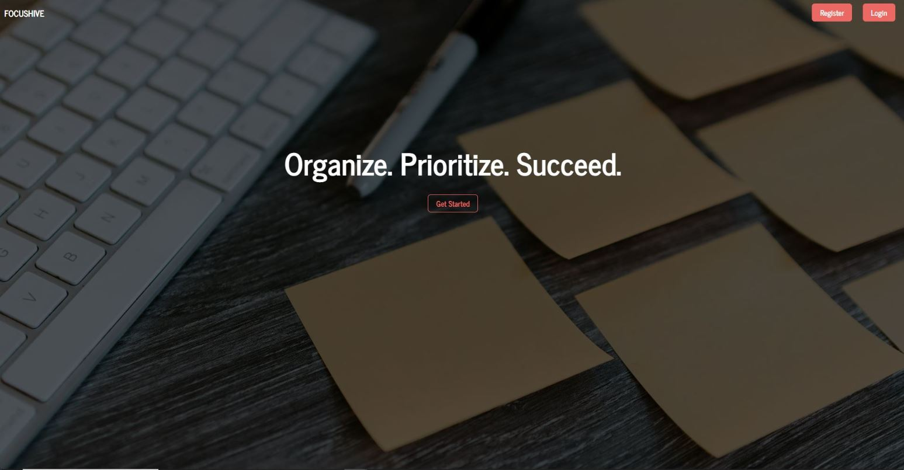
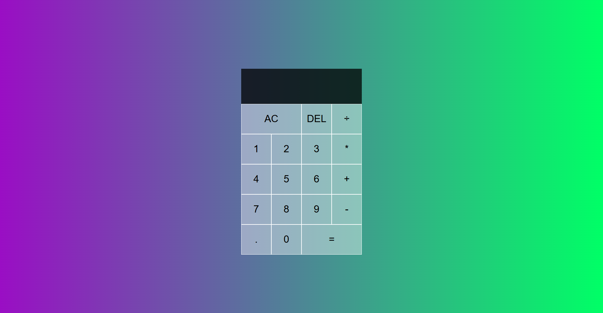

# 🙌 Zander Harding — Software Developer (Django • React • AI/Automation)

A multidisciplinary developer with a strong focus on Python, Django, and React, building real-world applications across backend engineering, advanced UI development, and AI-powered automation.

My projects range from full-stack web apps to AI voice assistants, showcasing problem-solving, clean architecture, and production-ready development.

I am actively seeking React, Django, Full-Stack (React + Django), or AI/Automation Developer roles as a Junior.

---

## 🚀 Featured Projects

### 🐝 FocusHive — Task Management App (Django, AWS, PostgreSQL)

A minimalist but production-ready task management application designed for simplicity and efficiency. Includes cloud storage, relational databases, and a custom Django backend with user authentication.

- Tech Stack: Django • PostgreSQL (AWS RDS) • AWS S3 • Bootstrap5 • HTML5/CSS3

- Highlights: Cloud hosting, media storage, relational database design, CRUD logic.

### 🎬 Netflix Clone — Streaming Platform (Django, Tailwind, AWS)

A Netflix-style streaming platform built with Django, featuring user login, movie browsing, personalized lists, and dynamic content rendering.

- Tech Stack: Django • PostgreSQL • AWS S3 • TailwindCSS • JavaScript
- 
- Highlights: Auth system, dynamic content filtering, responsive UI, cloud deployment.

### 🔄 Task Manager w/ JWT — Full-Stack (React + Django REST)

A clean, modern task manager app demonstrating how React connects to a Django REST backend secured by JWT authentication.

- Tech Stack: Django • DRF • SQLite • React • Axios • JWT Auth

- Highlights: Login system, protected routes, API integration, authentication.

### 🎬 Movie Search Engine (React)

A responsive movie-searching app built with React, powered by the TMDB API with routing, reusable components, and clean UI structure.

- Tech Stack: React 19 • Vite • React Router • TMDB API • CSS3

- Highlights: API integration, global state, dynamic routing, user-focused UI.

### 🧮 Calculator App (React)

A sleek, gradient-styled calculator built using the useReducer pattern for state management.

- Tech Stack: React 19 • Vite • CSS3 • useReducer
- Highlights: Component architecture, input handling, reducer-based logic.

---

## 📚 Full Project Catalog

### Frontend (React)

- Movie Search Engine (React)
Clean, API-driven search interface using React 19 + Vite.

- Calculator App (React)
Reducer-based calculator with modern UI.

- To-Do List (React)
Minimal task tracker with LocalStorage persistence.

- Cafe Counter (HTML/CSS/JS)
Lightweight DOM-manipulation project deployed on Netlify.

### Full-Stack & Backend (Django)

- FocusHive (Django, AWS, PostgreSQL)
Task management app with cloud hosting.

- Netflix Clone (Django, Tailwind, AWS S3)
Full streaming interface with auth and media browsing.

- Task Manager — React + Django JWT
Full-stack JWT authentication demo.

### APIs

- Django Blogpost REST API (DRF)
A fully functional REST API with full CRUD support and clean endpoint structure.

- Tech Stack: Django 5.2 • DRF • SQLite3

### AI / Automation Projects

- AI Voice Assistant for Doctor’s Office (Flask + LiveKit + OpenAI)
Real-time voice assistant with streaming transcription, WebRTC audio, and intelligent assistant logic. Simulates real call-center workflows.

- LangChain Autonomous AI Agent (Python)
An agent that performs multi-step reasoning, tool usage, and workflow automation using LangChain.

- Browser-Based AI Web Scraper
Lightweight scraper with AI-assisted extraction and browser automation logic.

---

## 🛠️ Skills & Technologies

- Languages: Python • JavaScript • SQL
- Frameworks: Django • Django REST Framework • React 19 • Vite • TailwindCSS • Bootstrap5
- AI/ML: OpenAI APIs • LangChain • LiveKit Voice
- Databases: PostgreSQL • SQLite
- Cloud: AWS S3 • AWS RDS • Render • Netlify
- Tools: Git • GitHub • Axios • JWT • LocalStorage

--- 

## 📫 Contact

GitHub: your-profile-link
Email: zandernh@gmail.com

Open to fully remote roles across the US, EU, and international teams.
