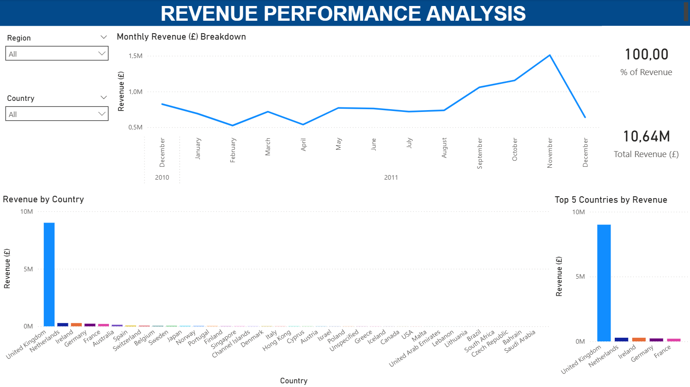
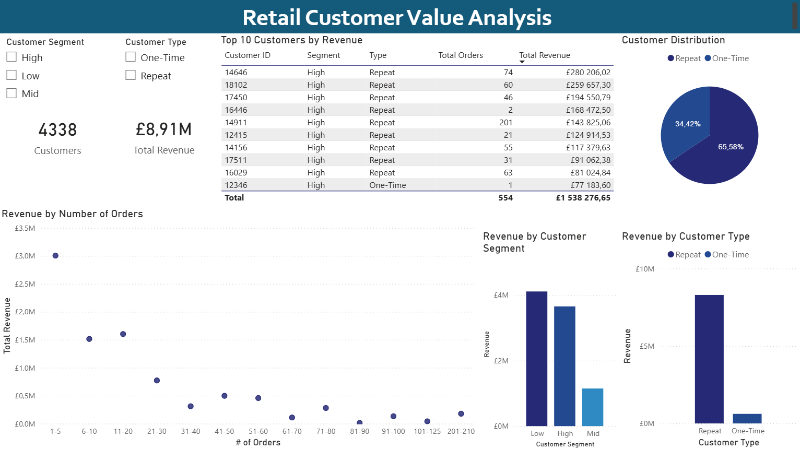
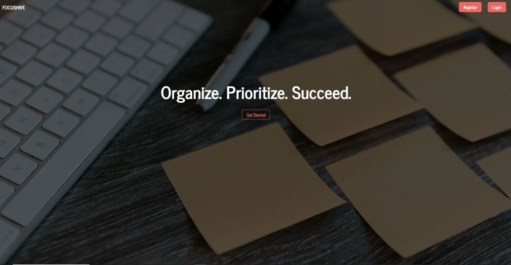
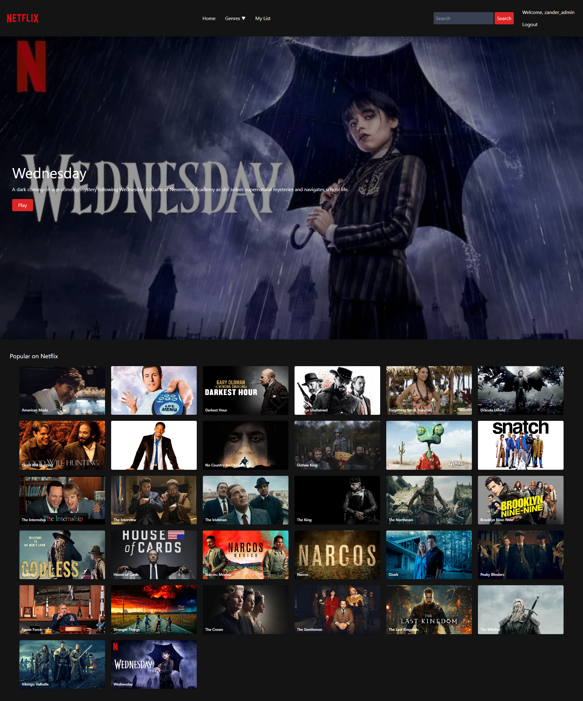
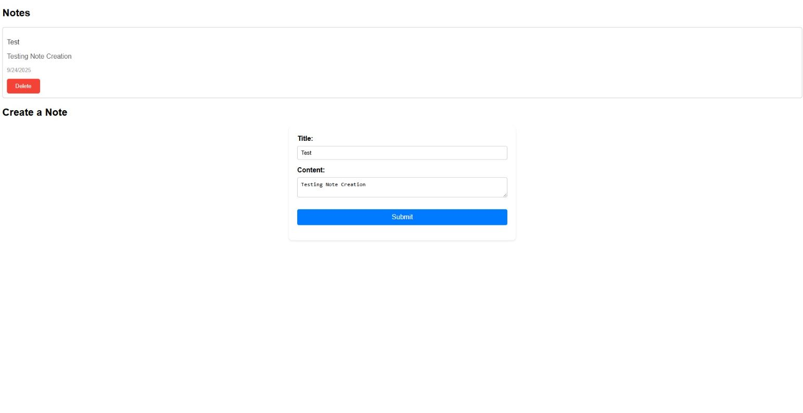
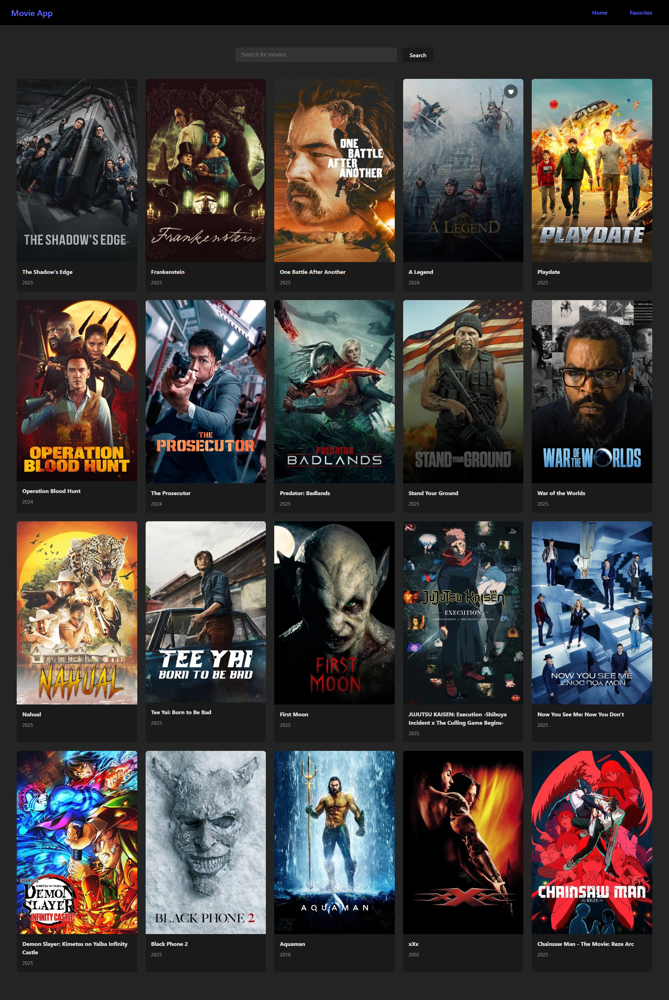
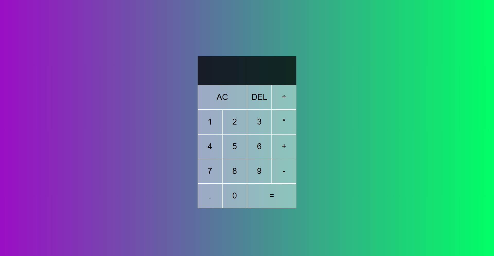

# 🙌 Zander Harding  
# — Data Analyst & Software Developer (Excel • SQL • Power BI • Python • React • AI/Automation)

A data-focused analyst and developer building practical business intelligence solutions, dashboards, and full-stack applications using Power BI, SQL, Excel, Python, Django, and React.

My primary focus is Data Analytics & Business Intelligence — transforming raw data into actionable insights through SQL querying, dashboard development, KPI reporting, and data storytelling.

Alongside analytics, I also build full-stack software applications and APIs, giving me a strong technical foundation in backend development, automation, and modern web technologies.

I am actively seeking Junior opportunities in:
- Data Analytics
- Business Intelligence
- BI / Reporting
- SQL & Dashboard Development
- Python Development
- Full-Stack Development

---

# 📊 Featured Data Analytics & BI Projects

### 📊 Revenue Performance Analysis (SQL, Excel, Power BI) [🔗 Link](https://github.com/zandernh/Revenue-Performance-Analysis)

End-to-end revenue analytics project focused on identifying geographic revenue concentration, seasonal trends, and business growth opportunities using SQL, Excel, Power BI, and executive reporting techniques.

- Tech Stack: PostgreSQL • SQL • Excel • Power BI • Power Query • DAX • PDF Reporting

- Highlights: SQL data aggregation, Excel exploratory analysis, Power BI dashboard developement, DAX KPI calculations, Regional revenue modelling, business reporting, interactive slicers & KPI cards.

#### Key Insights:
- United Kingdom contributed ~84% of total revenue
- Top 5 countries generated ~97% of total revenue
- Strong Q4 seasonal revenue trend identified
- Revenue heavily concentrated in a small number of markets

### 📊 Customer Value Analysis (SQL, Excel, Power BI) [🔗 Link](https://github.com/zandernh/Customer-Value-Analysis)

End-to-end customer analytics project focused on customer segmentation, retention analysis, purchasing behavior, and revenue concentration using SQL, Excel, Power BI, and business reporting techniques.

- Tech Stack: PostgreSQL • SQL • Excel • Power BI • Power Query • PDF Reporting

- Highlights: SQL CTEs & CASE statements, customer segmentation modelling, Excel exploratory analysis, Power BI dashboard development, customer retention analysis, interactive filtering, business reporting & data storytelling.

#### Key Insights:
- Repeat customers generated ~93% of total revenue
- Top 10 customers contributed ~17% of total revenue
- Revenue heavily concentrated among loyal high-value customers
- High Segment customers generated significantly higher revenue per customer

---

## 📚 Full Analytics Project Catalog

[🔗 Revenue Performance Analysis](https://github.com/zandernh/Revenue-Performance-Analysis)

End-to-end revenue analytics project focused on geographic revenue concentration, seasonal trends, and business growth opportunities using SQL, Excel, Power BI, and executive reporting.

[🔗 Customer Value Analysis](https://github.com/zandernh/Customer-Value-Analysis)

Customer analytics project focused on customer segmentation, retention analysis, purchasing behavior, and revenue concentration using SQL, Excel, Power BI, and business reporting.

---

## 🚀 Featured Software Projects

### 🐝 FocusHive — Task Management App (Django, AWS, PostgreSQL) [🔗 Link](https://github.com/zandernh/focushive)

A minimalist but production-ready task management application designed for simplicity and efficiency. Includes cloud storage, relational databases, and a custom Django backend with user authentication.

- Tech Stack: Django • PostgreSQL (AWS RDS) • AWS S3 • Bootstrap5 • HTML5/CSS3

- Highlights: Cloud hosting, media storage, relational database design, CRUD logic.

### 🎬 Netflix Clone — Streaming Platform (Django, Tailwind, AWS) [🔗 Link](https://github.com/zandernh/Netflix-Clone)

A Netflix-style streaming platform built with Django, featuring user login, movie browsing, personalized lists, and dynamic content rendering.

- Tech Stack: Django • PostgreSQL • AWS S3 • TailwindCSS • JavaScript
- 
- Highlights: Auth system, dynamic content filtering, responsive UI, cloud deployment.

### 🔄 Task Manager w/ JWT — Full-Stack (React + Django REST) [🔗 Link](https://github.com/zandernh/task-manager)

A clean, modern task manager app demonstrating how React connects to a Django REST backend secured by JWT authentication.

- Tech Stack: Django • DRF • SQLite • React • Axios • JWT Auth

- Highlights: Login system, protected routes, API integration, authentication.

### 🎬 Movie Search Engine (React) [🔗 Link](https://github.com/zandernh/react_movie_search_engine)

A responsive movie-searching app built with React, powered by the TMDB API with routing, reusable components, and clean UI structure.

- Tech Stack: React 19 • Vite • React Router • TMDB API • CSS3

- Highlights: API integration, global state, dynamic routing, user-focused UI.

### 🧮 Calculator App (React) [🔗 Link](https://github.com/zandernh/react_calculator)

A sleek, gradient-styled calculator built using the useReducer pattern for state management.

- Tech Stack: React 19 • Vite • CSS3 • useReducer
- Highlights: Component architecture, input handling, reducer-based logic.

---

## 📚 Full Software Project Catalog

### Frontend (React)

[🔗 Movie Search Engine (React)](https://github.com/zandernh/react_movie_search_engine)

Clean, API-driven search interface using React 19 + Vite.

[🔗 Calculator App (React)](https://github.com/zandernh/react_calculator)

Reducer-based calculator with modern UI.

[🔗 To-Do List (React)](https://github.com/zandernh/react_to-do)

Minimal task tracker with LocalStorage persistence.

[🔗 Cafe Counter (HTML/CSS/JS)](https://github.com/zandernh/cafe-counter)

Lightweight DOM-manipulation project deployed on Netlify.

### Full-Stack & Backend (Django)

[🔗 FocusHive (Django, AWS, PostgreSQL)](https://github.com/zandernh/focushive)

Task management app with cloud hosting.

[🔗 Netflix Clone (Django, Tailwind, AWS S3)](https://github.com/zandernh/Netflix-Clone)

Full streaming interface with auth and media browsing.

[🔗 Task Manager — React + Django JWT](https://github.com/zandernh/task-manager)

Full-stack JWT authentication demo.

### APIs

[🔗 Django Blogpost REST API (DRF)](https://github.com/zandernh/python_django_rest_api_blogpost)

A fully functional REST API with full CRUD support and clean endpoint structure.

- Tech Stack: Django 5.2 • DRF • SQLite3

[🔗 Django REST API - User Management](https://github.com/zandernh/python_django_rest_api)

A simple and clean Django REST API designed for storing, retrieving, updating, and deleting user information.

- Tech Stack: Django 5.2 • DRF • SQLite3

---
## 🛠️ Skills & Technologies

### 📊 Data Analytics & Business Intelligence

- Power BI
- Microsoft Excel
- Power Query
- DAX
- SQL
- PostgreSQL
- Data Cleaning & Transformation
- Dashboard Development
- KPI Reporting
- Business Intelligence
- Data Visualization
- Data Storytelling

### 💻 Programming & Development

- Python
- JavaScript
- Django
- Django REST Framework (DRF)
- React 19
- Vite
- HTML5 / CSS3
- TailwindCSS
- Bootstrap5

### ☁️ Cloud & Deployment

- AWS S3
- AWS RDS
- Render
- Netlify

### 🤖 AI / Automation

- OpenAI APIs
- LangChain
- LiveKit Voice

### 🧰 Tools & Workflow

- Git
- GitHub
- pgAdmin
- Axios
- JWT Authentication
- REST APIs
- LocalStorage 

--- 

## 📫 Contact

Email: zandernh@gmail.com

Open to fully remote roles across South Africa, the US, EU, and other international teams.
